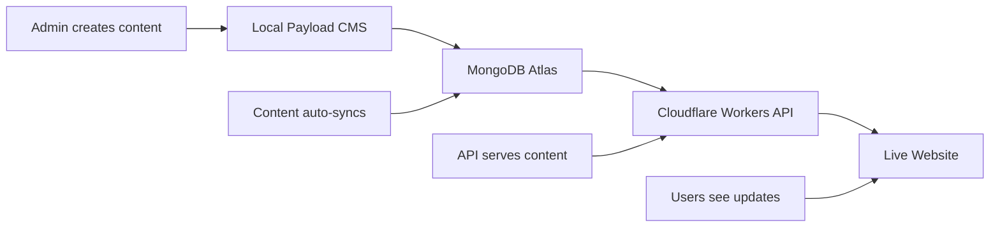

# Bitcoin Perception Intelligence Platform

A modern Bitcoin narrative intelligence platform built with React, Payload CMS, and Cloudflare infrastructure.

## 🚀 Live Site

- **Production**: https://perception.to
- **Learn Articles**: https://perception.to/learn (59 articles)
- **Glossary**: https://perception.to/glossary (10 entries)

## 📋 Architecture Overview

- **Frontend**: React + Vite (deployed to Cloudflare Pages)
- **Backend API**: Cloudflare Workers (serving MongoDB data)
- **Content Management**: Payload CMS v1 (local admin interface)
- **Database**: MongoDB Atlas
- **Deployment**: Cloudflare Pages + Workers

## 🎯 Adding New Content

### 📚 Adding Learn Articles

1. **Start the Content Management System**:
   ```bash
   cd payload-v1
   npm start
   ```

2. **Access Admin Panel**:
   - Open http://localhost:3000/admin
   - Login with your admin credentials

3. **Create New Article**:
   - Navigate to "Learn" collection
   - Click "Create New"
   - Fill out the form:
     - **Title**: Article headline
     - **Slug**: URL-friendly version (auto-generated)
     - **Excerpt**: Brief description for listings
     - **Content**: Full article content (rich text editor)
     - **Category**: Article category (optional)
     - **Tags**: Comma-separated tags (optional)
     - **Read Time**: Estimated minutes (optional)
     - **Difficulty**: beginner/intermediate/advanced
     - **Featured**: Check to highlight on homepage
     - **Published**: Check to make live
     - **Published At**: Publication date

4. **Save & Publish**:
   - Click "Save" 
   - Content automatically syncs to MongoDB
   - New article appears on live site within minutes

### 📖 Adding Glossary Entries

1. **Start the Content Management System**:
   ```bash
   cd payload-v1
   npm start
   ```

2. **Access Admin Panel**:
   - Open http://localhost:3000/admin

3. **Create New Entry**:
   - Navigate to "Glossary" collection
   - Click "Create New"
   - Fill out the form:
     - **Title**: Term name
     - **Slug**: URL-friendly version (auto-generated)
     - **Description**: Clear definition/explanation
     - **Category**: bitcoin/stablecoins/regulation/macro
     - **Published**: Check to make live

4. **Save & Publish**:
   - Click "Save"
   - Entry automatically syncs to MongoDB
   - New glossary entry appears on live site within minutes

## 🔄 Content Workflow



## 🛠 Development Setup

### Initial Setup
```bash
# Clone repository
git clone https://github.com/fernikolic/perception-to.git
cd bitcoin-perception

# Install dependencies
npm install

# Install Payload CMS dependencies
cd payload-v1
npm install
cd ..
```

### Running Locally
```bash
# Start frontend (React dev server)
npm run dev

# In separate terminal - start Payload CMS admin
cd payload-v1
npm start
# Access admin at http://localhost:3000/admin
```

### Building & Deploying
```bash
# Build the project
npm run build

# Deploy to Cloudflare Pages
npx wrangler pages deploy dist --project-name=perception-to

# Commit changes
git add .
git commit -m "Add new content"
git push origin main
```

## 🗂 Project Structure

```
bitcoin-perception/
├── src/                    # React frontend
│   ├── pages/
│   │   ├── learn/         # Learn articles pages
│   │   └── glossary/      # Glossary pages
│   └── lib/
│       └── payloadClient.ts  # API client
├── functions/             # Cloudflare Workers
│   └── api/
│       ├── learn.js      # Learn articles API
│       └── glossary.js   # Glossary API
├── payload-v1/           # Payload CMS
│   ├── src/
│   │   ├── collections/  # Content schemas
│   │   └── server.js     # CMS server
│   └── payload.config.js # CMS configuration
└── dist/                 # Built frontend files
```

## 📊 Content Management Features

### Learn Articles
- **Rich Text Editor**: Full WYSIWYG content creation
- **Categories**: Organize by topic
- **Tags**: Multi-tag support for filtering
- **Featured Articles**: Highlight important content
- **Reading Time**: Auto-calculated estimates
- **Difficulty Levels**: Beginner to advanced
- **Search**: Full-text search across titles and content
- **SEO-Friendly URLs**: Auto-generated slugs

### Glossary Entries
- **Clean Definitions**: Focused term explanations
- **Categories**: Bitcoin, Stablecoins, Regulation, Macro
- **Search**: Find terms quickly
- **Cross-Linking**: Reference between entries
- **SEO-Optimized**: Individual pages for each term

## 🔧 Current API Setup

**Note**: Currently using fallback data in Cloudflare Workers due to MongoDB Data API configuration. This provides:

- ✅ **Immediate functionality** with real content
- ✅ **Full feature parity** (search, filtering, pagination)
- ✅ **Fast performance** via edge computing

### Upgrading to Live MongoDB (Future)

To connect directly to live MongoDB:

1. **Enable MongoDB Data API** in Atlas dashboard
2. **Update API endpoints** in `functions/api/` files
3. **Replace fallback data** with direct queries
4. **Redeploy** to Cloudflare Pages

## 🚨 Important Notes

### Content Updates
- **Local Changes Only**: Content must be added through local Payload CMS
- **Auto-Sync**: Changes automatically sync to MongoDB Atlas
- **Live Updates**: New content appears on site within minutes
- **No Direct Database Editing**: Always use Payload CMS interface

### Publishing Workflow
1. Create content locally via Payload CMS admin
2. Content syncs to MongoDB Atlas
3. Cloudflare Workers serve content via API
4. Live site updates automatically

### Backup & Recovery
- **Database**: MongoDB Atlas handles backups
- **Code**: GitHub repository with full history
- **Content**: Export via Payload CMS admin interface

## 📞 Support

For technical issues:
1. Check Payload CMS logs in terminal
2. Verify MongoDB connection
3. Test API endpoints locally
4. Check Cloudflare Workers logs

## 🔮 Roadmap

- [ ] Connect to live MongoDB Data API
- [ ] Add content preview functionality
- [ ] Implement content scheduling
- [ ] Add multimedia support (images, videos)
- [ ] Enhanced search with filters
- [ ] Content analytics and insights

---

**Your Bitcoin perception intelligence platform is ready for content creation!** 🚀 