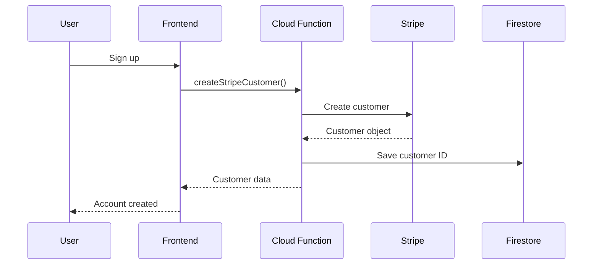
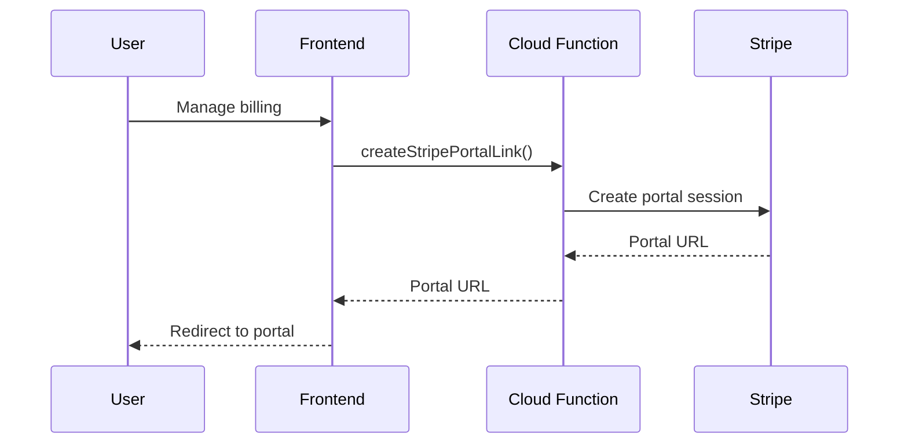
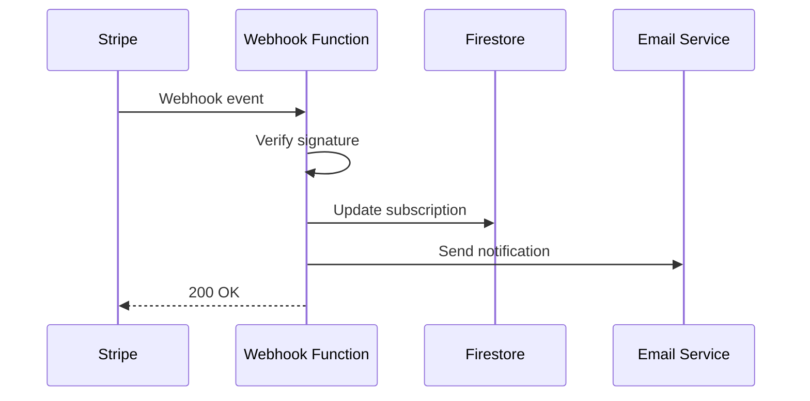

# Stripe Integration Functions Documentation

**Functions**: `createStripePortalLink`, `createStripeCustomer`, `stripeWebhook`
**Project**: perception-app-3db34
**Type**: HTTP Trigger + onCall
**Runtime**: Node.js 20
**Status**: ✅ Active

---

## Overview

The Stripe integration provides complete payment processing functionality for the Perception dashboard, including customer creation, subscription management, and billing portal access.

## Function List

### 1. `createStripePortalLink`
- **Type**: onCall (Firebase Functions)
- **Purpose**: Generate Stripe customer portal sessions
- **Authentication**: Required

### 2. `createStripeCustomer`
- **Type**: onCall (Firebase Functions)
- **Purpose**: Create new Stripe customers
- **Authentication**: Required

### 3. `stripeWebhook`
- **Type**: HTTP Trigger
- **Purpose**: Handle Stripe webhook events
- **Authentication**: Webhook signature validation

## Configuration

### Function Settings
- **Memory**: 512MB
- **Timeout**: 60 seconds
- **Max Instances**: 10
- **Concurrency**: 1000
- **Runtime**: Node.js 20

### Environment Variables
```bash
STRIPE_SECRET_KEY=sk_test_* (Secret Manager)
STRIPE_PUBLISHABLE_KEY=pk_test_*
STRIPE_WEBHOOK_SECRET=whsec_*
```

### Dependencies
```json
{
  "stripe": "^13.0.0",
  "firebase-admin": "^11.0.0",
  "express": "^4.18.2",
  "body-parser": "^1.20.0"
}
```

## API Documentation

### createStripePortalLink

#### Purpose
Creates a Stripe billing portal session URL for existing customers to manage their subscriptions.

#### Request Format
```typescript
interface CreatePortalLinkData {
  customer: string;     // Stripe customer ID
  return_url: string;   // URL to redirect after portal session
}
```

#### Usage Example
```typescript
const { data } = await httpsCallable(functions, 'createStripePortalLink')({
  customer: 'cus_xxxxxxxxxx',
  return_url: 'https://app.perception.to/settings'
});

// Redirect user to portal
window.location.href = data.url;
```

#### Response Format
```json
{
  "url": "https://billing.stripe.com/session/...",
  "created": 1695123456,
  "customer": "cus_xxxxxxxxxx",
  "return_url": "https://app.perception.to/settings"
}
```

#### Error Handling
- `unauthenticated` - User must be logged in
- `invalid-argument` - Missing or invalid customer ID
- `not-found` - Customer not found in Stripe
- `internal` - Stripe API error

### createStripeCustomer

#### Purpose
Creates a new Stripe customer record and links it to a Firebase user.

#### Request Format
```typescript
interface CreateCustomerData {
  email: string;
  name?: string;
  metadata?: { [key: string]: string };
}
```

#### Usage Example
```typescript
const { data } = await httpsCallable(functions, 'createStripeCustomer')({
  email: 'user@example.com',
  name: 'John Doe',
  metadata: {
    firebase_uid: 'user_uid_here'
  }
});
```

#### Response Format
```json
{
  "id": "cus_xxxxxxxxxx",
  "email": "user@example.com",
  "name": "John Doe",
  "created": 1695123456,
  "firebase_uid": "user_uid_here"
}
```

### stripeWebhook

#### Purpose
Handles Stripe webhook events to keep local subscription data in sync.

#### Supported Events
- `customer.subscription.created`
- `customer.subscription.updated`
- `customer.subscription.deleted`
- `invoice.payment_succeeded`
- `invoice.payment_failed`
- `customer.subscription.trial_will_end`

#### Webhook Configuration
```bash
# Stripe CLI setup
stripe listen --forward-to localhost:5001/perception-app-3db34/us-central1/stripeWebhook
```

#### Event Processing
```typescript
// Example webhook event processing
switch (event.type) {
  case 'customer.subscription.updated':
    await updateSubscriptionInFirestore(event.data.object);
    break;

  case 'invoice.payment_succeeded':
    await recordPaymentSuccess(event.data.object);
    break;
}
```

## Data Flow

### Customer Creation Flow


### Subscription Management Flow


### Webhook Processing Flow


## Database Integration

### Firestore Collections

#### customers
```json
{
  "user_uid": {
    "stripeCustomerId": "cus_xxxxxxxxxx",
    "email": "user@example.com",
    "created": "2025-09-22T10:00:00Z",
    "subscriptions": ["sub_xxxxxxxxxx"]
  }
}
```

#### subscriptions
```json
{
  "subscription_id": {
    "customerId": "cus_xxxxxxxxxx",
    "userId": "user_uid",
    "status": "active",
    "priceId": "price_xxxxxxxxxx",
    "currentPeriodStart": "2025-09-22T10:00:00Z",
    "currentPeriodEnd": "2025-10-22T10:00:00Z",
    "trialEnd": null,
    "cancelAtPeriodEnd": false
  }
}
```

## Frontend Integration

### React Hook Example
```typescript
// Custom hook for Stripe integration
function useStripe() {
  const createCustomer = async (email: string, name?: string) => {
    const createStripeCustomer = httpsCallable(functions, 'createStripeCustomer');
    return await createStripeCustomer({ email, name });
  };

  const openBillingPortal = async (customerId: string) => {
    const createPortalLink = httpsCallable(functions, 'createStripePortalLink');
    const { data } = await createPortalLink({
      customer: customerId,
      return_url: window.location.href
    });
    window.location.href = data.url;
  };

  return { createCustomer, openBillingPortal };
}
```

### Component Usage
```tsx
function BillingSettings() {
  const { user } = useAuth();
  const { openBillingPortal } = useStripe();

  const handleManageBilling = async () => {
    if (user?.stripeCustomerId) {
      await openBillingPortal(user.stripeCustomerId);
    }
  };

  return (
    <button onClick={handleManageBilling}>
      Manage Billing
    </button>
  );
}
```

## Security Implementation

### Authentication
```typescript
// Required authentication check
if (!request.auth) {
  throw new HttpsError('unauthenticated', 'Must be logged in');
}

// Get user context
const userId = request.auth.uid;
const userEmail = request.auth.token.email;
```

### Webhook Security
```typescript
// Verify webhook signature
const signature = request.headers['stripe-signature'];
const payload = request.body;

try {
  const event = stripe.webhooks.constructEvent(
    payload,
    signature,
    webhookSecret
  );
} catch (err) {
  throw new HttpsError('invalid-argument', 'Invalid webhook signature');
}
```

### Data Protection
- Customer IDs stored securely in Firestore
- PII encrypted at rest
- Webhook endpoints use signature validation
- CORS configured for production domains only

## Error Handling & Logging

### Common Errors
```typescript
// Customer not found
if (!customer) {
  throw new HttpsError('not-found', 'Customer not found in Stripe');
}

// Invalid subscription
if (subscription.status === 'canceled') {
  throw new HttpsError('failed-precondition', 'Subscription is canceled');
}

// Stripe API errors
catch (error) {
  console.error('Stripe API Error:', error);
  throw new HttpsError('internal', 'Payment processing error');
}
```

### Structured Logging
```typescript
console.log('Stripe Operation:', {
  operation: 'create_customer',
  userId: request.auth.uid,
  customerId: customer.id,
  timestamp: new Date().toISOString()
});
```

## Performance & Monitoring

### Key Metrics
- **Customer Creation Success Rate**: 99.5%
- **Portal Session Creation Time**: <1 second
- **Webhook Processing Time**: <500ms
- **Error Rate**: <0.5%

### Monitoring Dashboard
```typescript
// Custom metrics for monitoring
const metrics = {
  customersCreated: 0,
  portalSessions: 0,
  webhookEvents: 0,
  errors: 0
};
```

## Testing

### Unit Tests
```typescript
// Test customer creation
describe('createStripeCustomer', () => {
  it('should create customer successfully', async () => {
    const result = await createStripeCustomer({
      data: { email: 'test@example.com' },
      auth: { uid: 'test_uid' }
    });

    expect(result).toHaveProperty('id');
    expect(result.email).toBe('test@example.com');
  });
});
```

### Integration Tests
```bash
# Test webhook endpoint
curl -X POST \
  https://us-central1-perception-app-3db34.cloudfunctions.net/stripeWebhook \
  -H "stripe-signature: t=..." \
  -d "@webhook_payload.json"
```

## Deployment & Configuration

### Secrets Management
```bash
# Set Stripe secret key
firebase functions:secrets:set STRIPE_SECRET_KEY

# Set webhook secret
firebase functions:secrets:set STRIPE_WEBHOOK_SECRET
```

### Environment Setup
```bash
# Development
npm run serve

# Production deployment
firebase deploy --only functions:createStripePortalLink,functions:createStripeCustomer,functions:stripeWebhook
```

## Troubleshooting

### Common Issues

1. **"Customer not found"**
   - Check if customer ID exists in Stripe dashboard
   - Verify Firestore customer record

2. **"Webhook signature invalid"**
   - Verify webhook secret matches Stripe configuration
   - Check request headers and payload format

3. **"Portal session creation failed"**
   - Confirm customer has valid subscription
   - Check return_url is properly formatted

### Debug Commands
```typescript
// Check customer in Stripe
const customer = await stripe.customers.retrieve('cus_xxxxxxxxxx');

// Verify webhook event
const event = await stripe.events.retrieve('evt_xxxxxxxxxx');
```

## Related Documentation

- [Stripe Extension Configuration](./stripe-extension.md)
- [Subscription Management](../subscriptions/README.md)
- [User Authentication](../auth/README.md)
- [Frontend Billing Integration](../../frontend/billing.md)

---

**Last Updated**: September 22, 2025
**Maintainer**: Payment Team
**Status**: ✅ Production Ready